# Custom Glass Industries, Inc. — Preventive Maintenance (PM) Portal

[-00b4f0?style=for-the-badge&logo=shield)](https://github.com/rockettpc/pm_portal)
[](https://github.com/rockettpc/pm_portal)
[-10b981?style=for-the-badge)](https://github.com/rockettpc/pm_portal)

Plant asset registry, preventive maintenance scheduler, spare parts requisition, work order execution engine, compliance audit logging, mobile QR utilities, and service documentation system designed specifically for the **Custom Glass Industries, Inc.** architectural glass fabrication plant in Anaheim, CA.

---

## 📄 Project Specifications & Phased Delivery Tracker

The entire project is built directly to the specifications outlined in the Product Requirements Document (PRD). Every phase and capability has been implemented, validated with automated test suites, and containerized.

👉 **[Read the Full Product Requirements Document (PRD)](./PM-Portal-PRD.md)**

### 🏆 Phased Implementation Progress (100% Complete)

| Phase | Module | Status | Highlights |
| :--- | :--- | :---: | :--- |
| **Phase 1** | **Foundation & Auth** | ✅ **Complete** | Open-source JWT/bcrypt auth with `httpOnly` cookies, RBAC (5 roles), many-to-many operator equipment scoping (`operator_equipment`), plant location hierarchy, equipment CRUD, document uploads, bilingual English/Spanish `i18next` foundation. |
| **Phase 2** | **Parts Requisitions & Catalog** | ✅ **Complete** | Spare parts inventory catalog with low-stock alerts, equipment BOM linking, parts requisition queue, server-side Sharp image compression (1920px WebP) for phone camera uploads, in-app approval/order workflow. |
| **Phase 3** | **PM Core & Work Orders** | ✅ **Complete** | Dual-trigger PM scheduler (calendar days & runtime meter hours), automated due-PM detection & idempotent work order generator, full work order lifecycle (`Open` &rarr; `In Progress` &rarr; `Completed`), interactive checklist execution, downtime minutes & root-cause logging, real-time parts inventory auto-deduction, automatic recurrence rescheduling upon completion, supervisor sign-offs. |
| **Phase 4** | **Dashboards & Reporting** | ✅ **Complete** | Real-time shop floor uptime wallboard (status grid grouped by plant area, 30s auto-refresh), live "recently down" equipment panel with stoppage timers, open parts requests aging queue, MTBF/MTTR analytics, and maintenance cost rollups. |
| **UI Polish** | **Brand Identity & Nav Streamlining** | ✅ **Complete** | Official **Custom Glass Industries, Inc.** brand asset integration, CGI Cyan (`#00b4f0`) & Oceanic Deep Blue theme, role-tailored top navigation, consolidated dropdown groupings (**Parts & Supplies**, **Management**), and unified user profile menu. |
| **Admin CRUD** | **Full Update/Delete & Data Recovery** | ✅ **Complete** | Complete Edit and Delete capabilities for elevated users across Equipment, Parts, PM Schedules, Work Orders, Parts Requests, and Users. Includes disk document/photo unlinking (`fs.unlinkSync`), automatic inventory return on deleted work orders, self-deletion guards, and audit trail logging. |
| **Phase 5** | **Localization & In-App Help** | ✅ **Complete** | 100% bilingual English/Spanish translation parity across 408 keys, contextual slide-over "How Do I..." help drawer per module, role-aware interactive guided walkthroughs with step progress dots, printable one-page quick-reference cheat sheets optimized for 8.5" x 11" letter paper. |
| **Phase 6** | **Shop-Floor Utilities & Polish** | ✅ **Complete** | Equipment QR code badge generation and printable asset stickers with CGI branding, live mobile camera QR scanner with reticle & manual asset ID fallback, rapid "Quick-Add" equipment entry form with category auto-tagging & real-time duplicate serial detection, system compliance audit trail viewer with one-click CSV export, and responsive mobile optimization. |

---

## 🎨 CGI Brand Identity & Decluttered Navigation Architecture

- **Visual Brand Palette:** Built using Custom Glass Industries, Inc.'s official corporate colors:
  - **CGI Cyan (`#00b4f0`):** Primary action buttons, active navigation markers, interactive filters, metric callouts, and glow accents.
  - **Oceanic Blue (`#0078be`):** Gradient header undertones and secondary interactive states.
  - **Architectural Glass Dark Slate (`#020617` / `#0f172a`):** High-contrast industrial shop-floor backdrop.
  - **High-Visibility Industrial Safety Standards:** Operational status indicators strictly adhere to plant safety conventions (Active = `emerald-500`, Outage/Down = `red-500`, Warning/Urgent = `amber-500`).
- **Streamlined Top Navigation (`Navbar.jsx`):**
  - **Role-Tailored Views:**
    - *Operators*: Stripped down to 3 essential operational tabs (*My Equipment*, *Work Orders*, *Parts Requests*).
    - *Technicians & Managers*: 1-click access to top tools (*Shop Wallboard*, *Equipment Registry*, *Work Orders*, *PM Schedules*); grouped secondary tools into clean, compact dropdowns (*Parts & Supplies*, *Management*).
  - **Unified User Profile Dropdown:** Consolidates user info, role badges, In-App Help, Quick-Reference Cheat Sheets, and Sign Out into a clean avatar menu.
  - **Quick Utility Access:** Fast camera QR scanner button and 1-click English/Spanish (`EN | ES`) language toggle pill.
  - **Responsive Mobile Drawer:** Clean hamburger drawer providing seamless touch navigation on shop-floor tablets and mobile devices.

---

## 📸 Visual Tour: System Modules & Live Interfaces

### 1. Branded Portal Authentication & Demo Login
Secure `httpOnly` cookie JWT authentication with one-click role selector chips for instant testing across all 5 permission levels (Admin, Manager, Technician, Operator, Viewer).
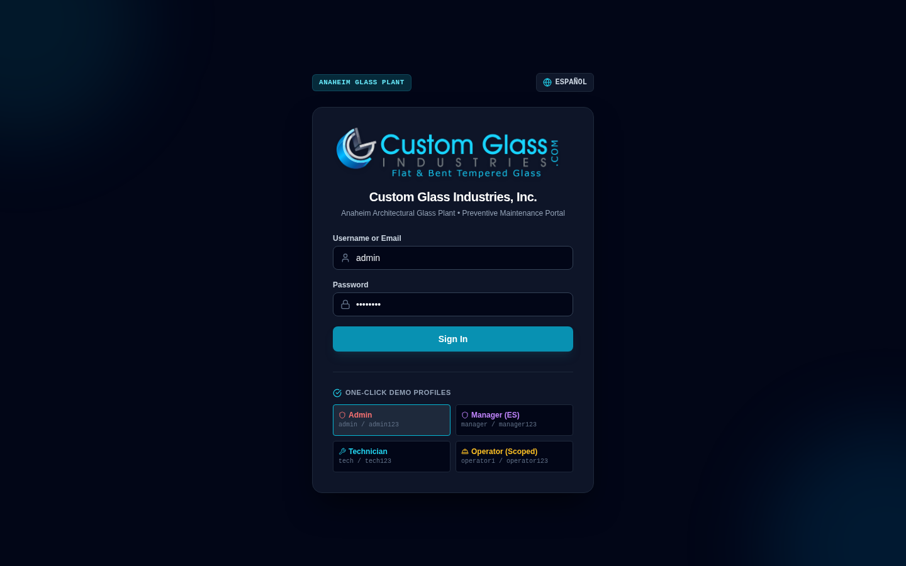

### 2. Shop Floor Status & Uptime Wallboard (PRD 3.8)
Designed for plant-floor TV mounting with 30-second auto-refresh, live availability metrics, machinery status grid grouped by area (Cutting, Tempering, Lamination, Edging), active stoppage timers, and aging parts orders.
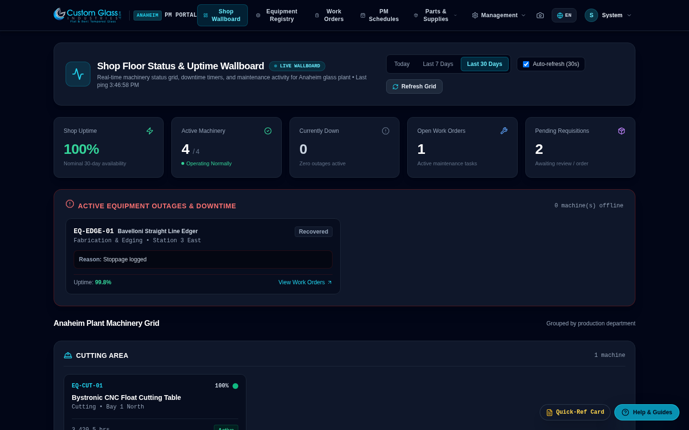

### 3. Plant Machinery & Equipment Registry (PRD 2.2)
Complete asset hierarchy with operating meters, current statuses, plant location groupings, service documentation attachments, operator scoping, QR badge generation, and Edit/Delete controls.
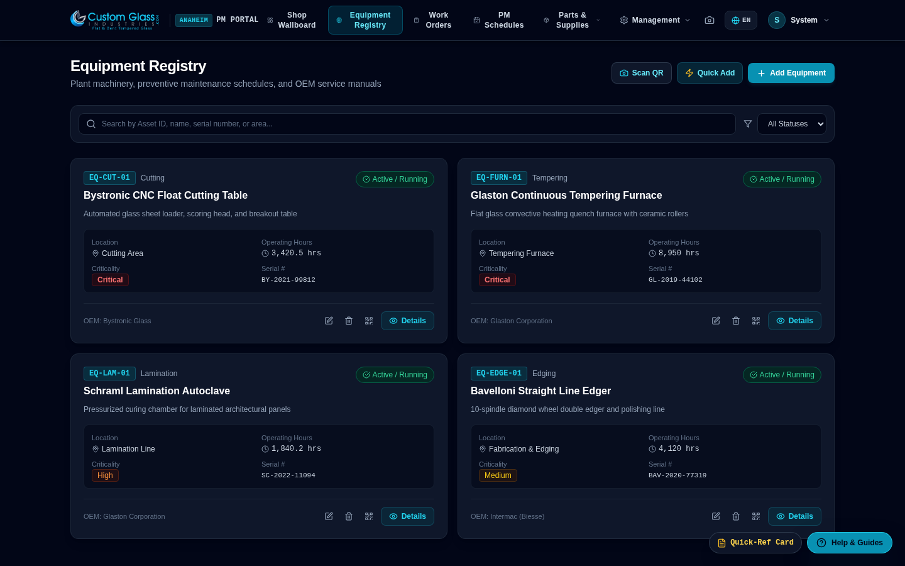

### 4. Equipment QR Code Generation & Printable Asset Stickers (PRD 3.10)
Instant high-resolution QR asset tags deep-linked directly to machinery service profiles. Features branded printable plant sticker cards ("Custom Glass Industries, Inc. - Anaheim Glass Plant - Asset Tag") with direct print and PNG download capabilities.
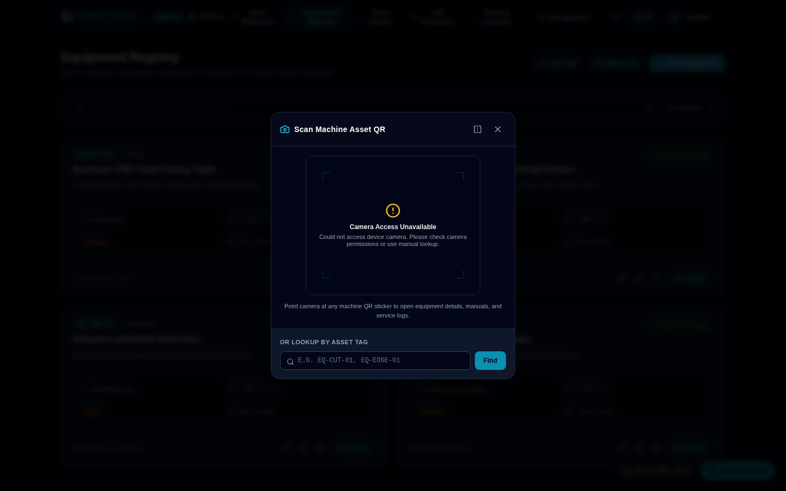

### 5. Rapid "Quick-Add" Equipment Entry (PRD 2.2)
High-speed equipment onboarding designed for plant floor audits. Automatically proposes the next sequential asset tag based on category prefix (e.g. `CUT` &rarr; `EQ-CUT-02`), provides real-time duplicate serial number detection, and features a "Save & Add Another" workflow.
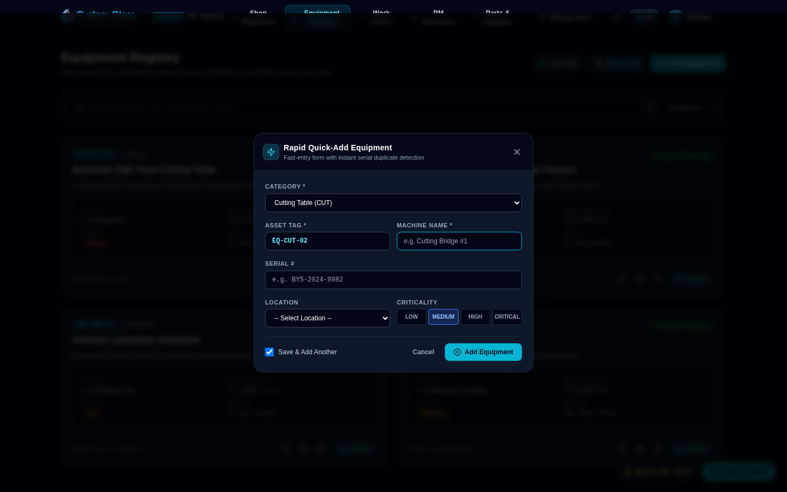

### 6. Work Orders Lifecycle Engine (PRD 3.4 & 3.5)
Interactive task checklists, labor hour recording, stoppage downtime & root-cause tracking, parts inventory auto-deduction, supervisor sign-offs, and full admin edit/delete controls with automatic inventory restocking.
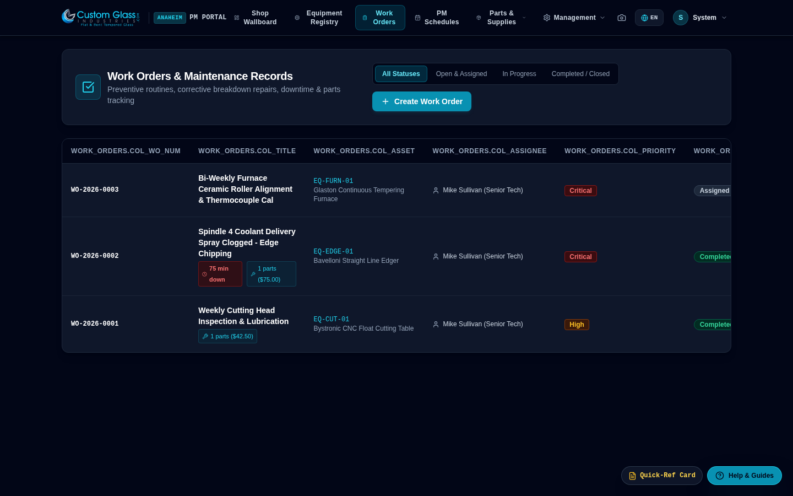

### 7. Preventive Maintenance Schedules & Dual Triggers (PRD 3.1 – 3.3)
Dual-trigger PM scheduling engine (calendar intervals and runtime-meter thresholds), automated due-PM detection with one-click scanning, dynamic checklist builder, manual trigger dispatch, and schedule maintenance.
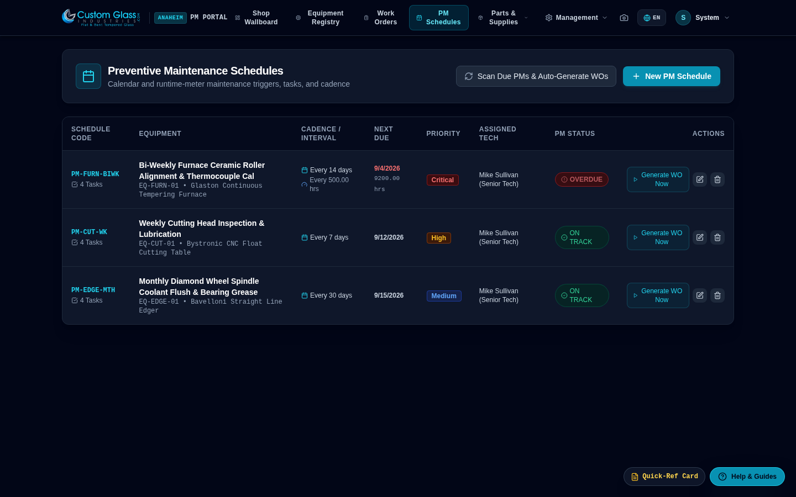

### 8. Parts Requisition & Approval Queue (PRD 2.3)
Floor operator request queue with urgency badges, manager approval/rejection/ordering workflow, in-memory WebP compressed camera photo uploads, and full editing/deletion with attached photo disk unlinking.
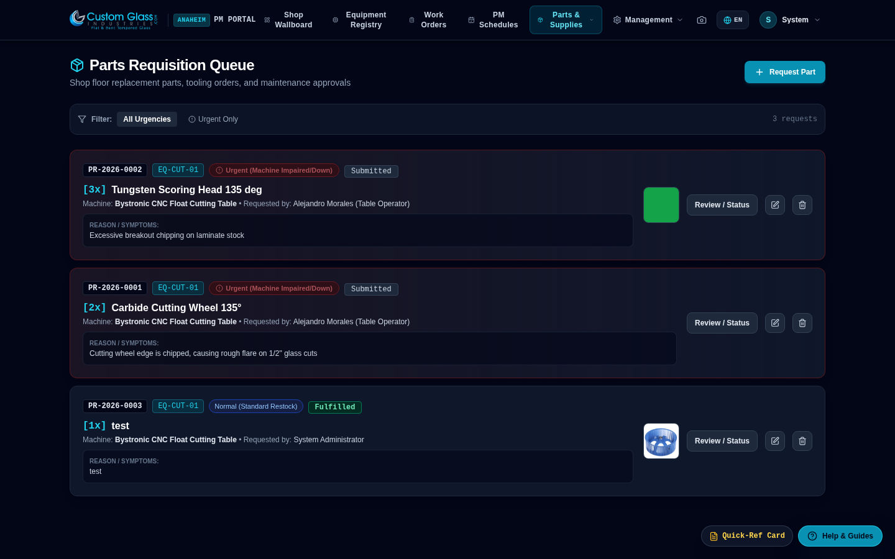

### 9. Spare Parts Inventory Catalog (PRD 2.4 & 3.6)
Plant spare parts inventory with category filtering, storage bin coordinates, real-time stock levels, automatic low-stock threshold warnings, and admin item editing and removal.
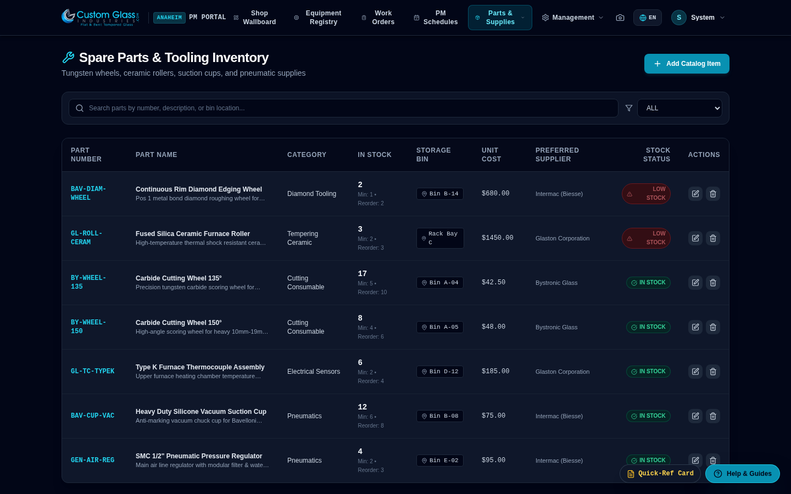

### 10. Plant Maintenance Analytics & Reliability (PRD 3.9)
Historical KPIs including on-time PM compliance rate %, MTBF (Mean Time Between Failures), MTTR (Mean Time to Repair), maintenance spend rollups ($65/hr labor + parts), and technician productivity leaderboards.
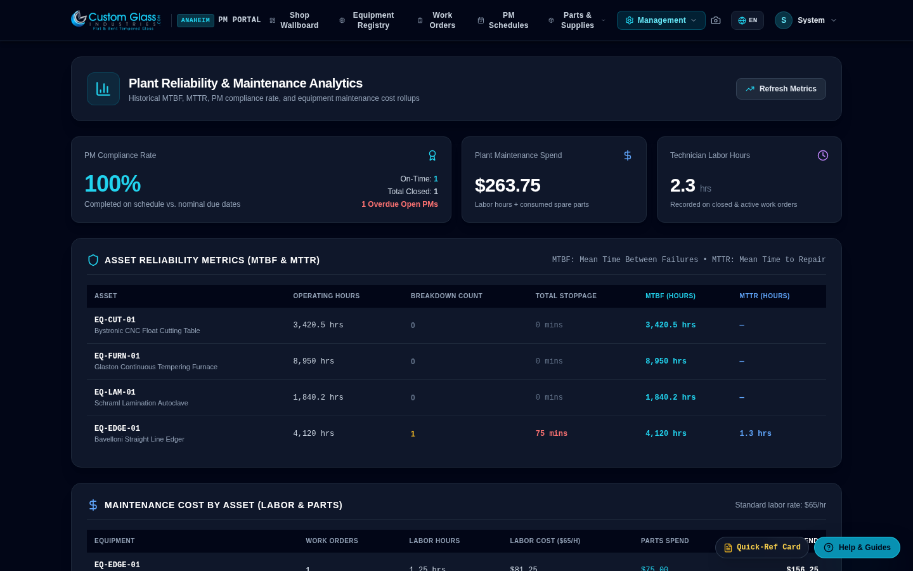

### 11. User Management & Operator Equipment Scoping (PRD 2.1)
Role-based access control (RBAC), direct admin password resets, account deletion protection, and many-to-many operator equipment scoping (`operator_equipment`) ensuring operators only see and interact with their assigned machinery.
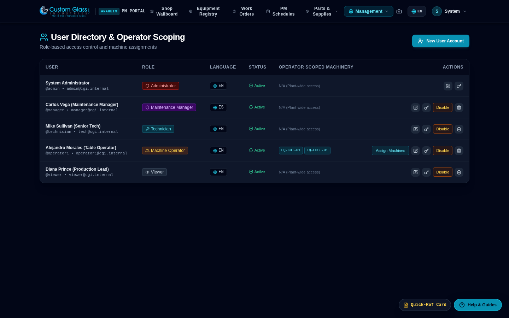

### 12. System Compliance Audit Trail & Export (PRD 3.10)
Paginated, searchable audit log capturing all system mutations (`CREATE`, `UPDATE`, `DELETE`, `LOGIN`, `CONSUME_PART`), user actors, timestamps, and deep JSON change diffs. Includes one-click CSV export for OSHA/ISO compliance reporting.
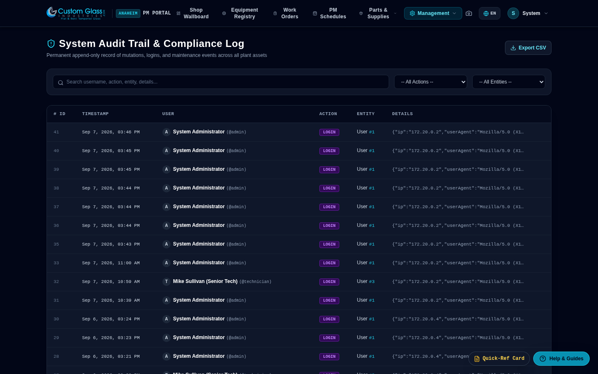

### 13. In-App Contextual Help Slide-Over Panel (PRD 3.10)
Context-aware slide-over drawer accessible from any screen. Dynamically tailors guidance to the user's role (Operator, Technician, Manager), provides accordion-style "How Do I..." task walkthroughs, and launches interactive tours.
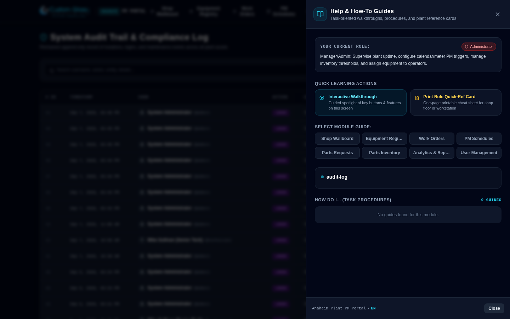

### 14. First-Visit Interactive Guided Walkthrough (PRD 3.10)
Visual spotlight walkthrough with step counter dots, "Previous", "Next", "Skip", and "Don't show again" persistence via `localStorage`. Guides new shop technicians through each module's core functions.
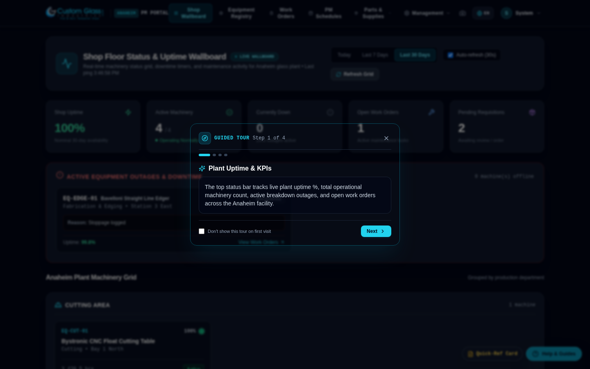

### 15. Printable One-Page Role Quick-Reference Cards (PRD 3.10)
Tailored one-page cheat sheets for Machine Operators, Maintenance Technicians, and Plant Managers. Features shift routine checklists, priority matrices, and plant emergency contacts, styled with `@media print` CSS for standard 8.5" x 11" letter paper.
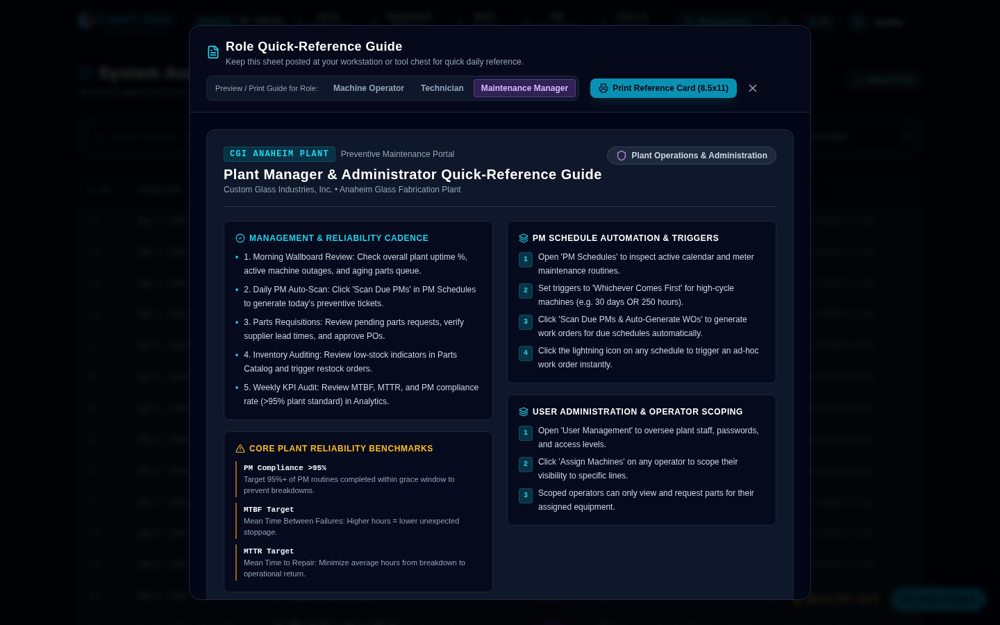

### 16. Shop Floor Camera QR Code Scanner (PRD 3.10)
Mobile camera stream integration via `html5-qrcode` with rear/environment camera default, targeting reticle, flip camera option, and haptic feedback. Instantly decodes asset tags and jumps directly to equipment manuals and service logs, with a manual lookup fallback.
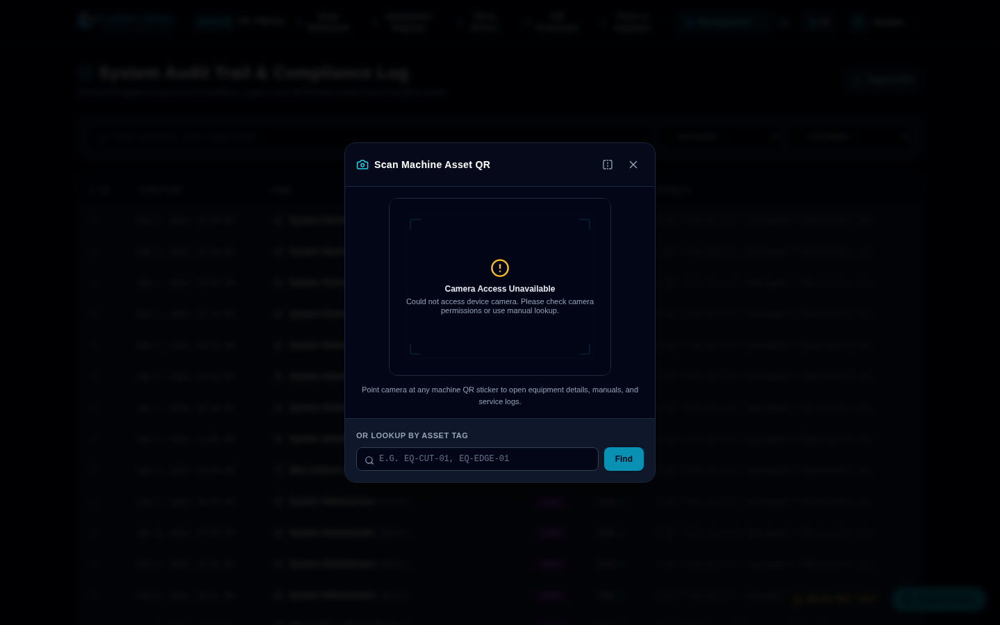

---

## 🚀 Live Capabilities

### 1. Equipment Registry & Operator Scoping
- **Asset Hierarchy:** Structured by Building &rarr; Area &rarr; Specific Location (Cutting Bay, Tempering Furnace Line, Lamination Cleanroom, Edging Station).
- **Strict Operator Scoping (PRD 2.1):** Floor operators are restricted at the database and API layer (`operator_equipment`) to viewing only their assigned machines and submitting parts requests or viewing maintenance for those machines alone.
- **Document Management:** Service manuals, wiring schematics, and warranties attached directly to assets with automatic disk unlinking on removal.
- **QR Asset Stickers:** Dynamic QR code generation with deep links and high-contrast printable stickers.
- **Rapid Quick-Add:** Accelerated equipment onboarding carrying forward category, location, and vendor data.

### 2. Spare Parts Catalog & Server-Side Image Compression
- **Catalog Management:** Tracks part numbers, categories (cutting consumables, tempering ceramics, diamond tooling, pneumatics), storage bins, reorder thresholds, and preferred OEM suppliers.
- **Requisition Workflow:** Floor operators and technicians submit parts requests with urgency flags (`Low`, `Normal`, `Urgent`). Managers review, approve, deny, order, and receive parts in a unified queue.
- **Zero Disk Bloat Photo Compression:** High-res mobile phone photos (5–15MB) are re-encoded and downsampled in-memory using `sharp` into optimized WebP images (max 1920px, 80% quality, ~6–50KB) before saving to disk.

### 3. Preventive Maintenance Core & Work Order Engine
- **Dual Triggers:** PM schedules support calendar-based triggers (e.g. every 7, 14, 30, 90 days), meter-based triggers (e.g. every 500 runtime hours), or "whichever comes first".
- **Automated Work Order Generation:** The engine scans active PMs, checks due dates and current operating hours, and auto-spawns work orders with pre-filled task checklists and priority flags without duplicating open orders.
- **Checklist Execution:** Technicians check off steps in real-time and attach technical readings or notes per item.
- **Downtime & Root Cause Tracking:** Log stoppage minutes and root-cause failure codes (e.g. glass particulate slurry clogging coolant lines).
- **Inventory Auto-Deduction:** Consuming spare parts on a work order immediately decrements stock from the warehouse catalog and fires low-stock alerts if hitting reorder thresholds.
- **Auto-Rescheduling:** Completing a PM work order automatically stamps `last_performed_date = CURRENT_DATE` and advances the schedule to the next due date and runtime meter threshold.
- **Supervisor Sign-Off:** Restricted to Managers and Administrators for quality assurance.

### 4. Shop Floor Uptime Wallboard & Maintenance Analytics (PRD 3.8 & 3.9)
- **Live Plant Uptime Wallboard:** Designed for shop-floor monitor displays with 30-second auto-refresh, selectable time windows (Today, Last 7 Days, Last 30 Days), and live shop-wide availability % calculation.
- **Machinery Status Grid:** Grouped by plant area (Cutting Area, Tempering Furnace, Lamination Line, Fabrication & Edging) with real-time status pulses (Active/Running, Down, In Storage) and runtime meters.
- **Active Outages & Downtime Tracker:** Automatically surfaces currently offline machines with running downtime timers, failure reasons, and immediate click-through to work orders.
- **Parts Requisition Aging Queue:** Ranks pending parts orders by urgency and elapsed age in hours and days so critical tooling orders never stall.
- **Asset Reliability Analytics:** Computes MTBF (Mean Time Between Failures) and MTTR (Mean Time to Repair) per machine.
- **Maintenance Cost Rollup:** Aggregates technician labor costs ($65/hr standard rate) and consumed parts spend per asset.
- **Technician Productivity & Parts Consumption:** Tracks closed work orders and labor hours per technician, and highlights top consumed spare parts by total spend.

### 5. Localization & In-App Help (Phase 5)
- **100% Spanish Translation Coverage:** Complete parity across all UI strings, error notifications, status badges, and help content.
- **Localized Formatters:** Dynamic date (`en-US` vs `es-US`), currency ($ USD), number grouping, and runtime hour formatting.
- **In-App Help Slide-Over Panel:** Non-intrusive drawer with role-filtered task procedures and tips.
- **Interactive First-Visit Walkthroughs:** Automatic visual spotlight tours for each module with progress dots and dismiss persistence.
- **Printable Quick-Reference Cheat Sheets:** Formatted for clean black-and-white printing on standard 8.5" x 11" paper without wasting printer toner.

### 6. Shop-Floor Utilities & Field Ergonomics (Phase 6)
- **Mobile QR Scanner:** Native camera video stream with environment/rear lens auto-selection, scan reticle, haptic feedback, and fallback asset ID search.
- **Printable Asset Stickers:** CGI-branded equipment badges ready for lamination and plant machine mounting.
- **Rapid Quick-Add Equipment:** Sub-minute asset registration form with auto-incrementing category tags and real-time duplicate serial validation.
- **Compliance Audit Trail:** Immutable logging of system events with query filters and one-click CSV export.

### 7. Administrative Full CRUD & Data Integrity
- **Full Update & Delete Across All Modules:** Complete administrative management for equipment, parts catalog, PM schedules, work orders, parts requests, and users.
- **Automatic Inventory Recovery:** Deleting a work order automatically calculates previously consumed parts and returns quantities back to the stock catalog (`parts.quantity_on_hand`).
- **Disk Cleanliness:** Deleting equipment or parts requests unlinks attached manual PDFs and failure photos from disk via `fs.unlinkSync`, preventing orphaned storage waste.
- **Self-Deletion Protection:** Guard prevents administrators from accidentally deleting their own accounts and locking themselves out.
- **Audit Logged:** Every update and deletion records previous and new values in the compliance audit trail.

---

## 🛠️ Tech Stack & Architecture

- **Database:** PostgreSQL 16 (Alpine container `pm_portal_db`, port `5432`, volume `pm_portal_db_data`)
- **Backend:** Node.js & Express (Container `pm_portal_backend`, port `5050`)
  - Safe Open-Source Auth: `bcryptjs` password hashing + signed `jsonwebtoken` in secure `httpOnly` cookies.
  - Image Processing: `sharp` for in-memory upload compression.
  - Storage: Persistent Docker volume `pm_portal_doc_storage` mounted at `/data/documents`.
- **Frontend:** React 18 + Vite + Tailwind CSS + Lucide Icons (Container `pm_portal_frontend`, port `3001`).
- **QR & Scanner:** `qrcode` for asset tag sticker generation; `html5-qrcode` for live camera stream barcode decoding.
- **Internationalization:** `i18next` with full English (`en.json`) and Spanish (`es.json`) dictionaries (408 keys, 100% parity).

---

## ⚡ Quick Start

### 1. Launch with Docker Compose
```bash
docker compose up -d
```

### 2. Access the Application
- **Frontend Web Portal:** `http://localhost:3001`
- **Backend REST API:** `http://localhost:5050/api`
- **Health Endpoint:** `http://localhost:5050/health`

### 3. Pre-Seeded Demo Accounts
One-click demo login chips are built right into the login screen:

| Role | Username / Email | Password | Scope & Language |
| :--- | :--- | :--- | :--- |
| **Admin** | `admin` (`admin@cgi.internal`) | `admin123` | Full plant configuration, user control & audit logs (EN) |
| **Manager** | `manager` (`manager@cgi.internal`) | `manager123` | PM scheduling, request approvals, sign-offs & audit logs (ES) |
| **Technician** | `technician` (`tech@cgi.internal`) | `tech123` | Work order execution, checklist sign-off, parts logging (EN) |
| **Operator** | `operator1` (`operator1@cgi.internal`) | `operator123` | **Scoped** to `EQ-CUT-01` & `EQ-EDGE-01` (ES) |
| **Viewer** | `viewer` (`viewer@cgi.internal`) | `viewer123` | Read-only plant equipment status (EN) |

---

## 📡 API Endpoints Overview

| Method | Endpoint | Description | Access |
| :--- | :--- | :--- | :--- |
| `POST` | `/api/auth/login` | Authenticate user & issue httpOnly cookie | Public |
| `GET` | `/api/auth/me` | Fetch authenticated profile & scope | Authenticated |
| `POST` | `/api/auth/logout` | Invalidate session | Authenticated |
| `GET` | `/api/equipment` | List equipment (scoped for operators) | Authenticated |
| `POST` | `/api/equipment` | Create equipment asset | Admin, Manager |
| `PUT` | `/api/equipment/:id` | Update equipment asset specifications | Admin, Manager |
| `DELETE` | `/api/equipment/:id` | Delete equipment, cascade schedules, unlink docs | Admin |
| `POST` | `/api/equipment/:id/documents` | Upload equipment service manual / schematic | Admin, Manager |
| `DELETE` | `/api/documents/:id` | Delete equipment document & unlink from disk | Admin |
| `GET` | `/api/pm-schedules` | List PM schedules (with overdue flags) | Authenticated |
| `POST` | `/api/pm-schedules` | Create PM schedule & checklist | Admin, Manager |
| `PUT` | `/api/pm-schedules/:id` | Update PM schedule interval/meter/checklist | Admin, Manager |
| `DELETE` | `/api/pm-schedules/:id` | Delete PM schedule | Admin |
| `POST` | `/api/pm-schedules/check-due` | Scan due PMs & auto-generate work orders | Admin, Manager, Tech |
| `POST` | `/api/pm-schedules/:id/trigger` | Manually spawn work order from schedule | Admin, Manager, Tech |
| `GET` | `/api/work-orders` | List work orders (scoped for operators) | Authenticated |
| `POST` | `/api/work-orders` | Create manual work order (Corrective/Inspection) | Admin, Manager, Tech |
| `PUT` | `/api/work-orders/:id` | Update status, checklist, hours, downtime, sign-off | Admin, Manager, Tech |
| `DELETE` | `/api/work-orders/:id` | Delete work order & return consumed parts to stock | Admin |
| `POST` | `/api/work-orders/:id/parts` | Log parts used (auto-deducts inventory) | Admin, Manager, Tech |
| `GET` | `/api/parts` | List parts catalog with stock levels | Authenticated |
| `POST` | `/api/parts` | Add new spare part to inventory | Admin, Manager |
| `PUT` | `/api/parts/:id` | Update part catalog details & reorder thresholds | Admin, Manager |
| `DELETE` | `/api/parts/:id` | Delete spare part from catalog | Admin |
| `GET` | `/api/parts-requests` | List parts requests (scoped for operators) | Authenticated |
| `POST` | `/api/parts-requests` | Submit request with compressed WebP photo | Authenticated |
| `PUT` | `/api/parts-requests/:id` | Update parts requisition details | Admin, Manager |
| `PUT` | `/api/parts-requests/:id/status` | Approve / Order / Receive parts request | Admin, Manager |
| `DELETE` | `/api/parts-requests/:id` | Delete parts request & unlink failure photo | Admin |
| `GET` | `/api/users` | List user accounts with roles & scoping | Admin, Manager |
| `POST` | `/api/users` | Create user account | Admin |
| `PUT` | `/api/users/:id` | Update user details & role | Admin |
| `PUT` | `/api/users/:id/password` | Direct administrative password reset | Admin |
| `DELETE` | `/api/users/:id` | Delete user account (with self-delete guard) | Admin |
| `GET` | `/api/audit-log` | Query system compliance audit events | Admin, Manager |
| `GET` | `/api/audit-log/export` | Export audit trail to CSV format | Admin, Manager |
